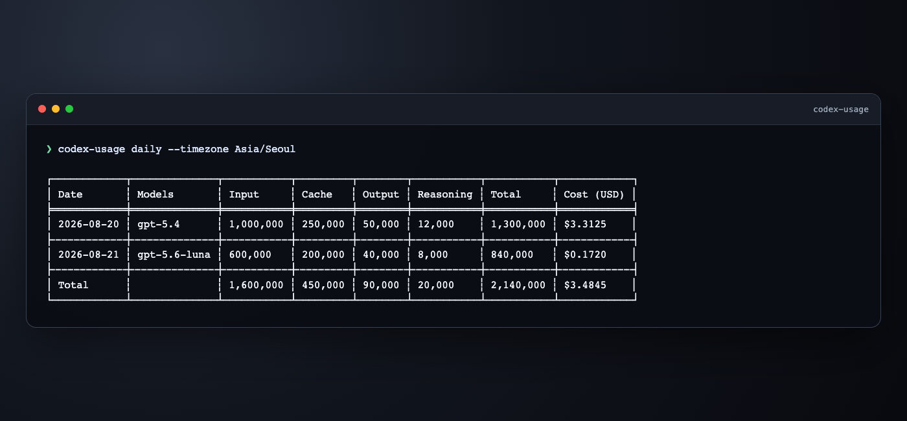

# codex-usage

Fast Codex usage analyzer written in Rust.




## Setup

### Install Rust

```bash
curl --proto '=https' --tlsv1.2 -sSf https://sh.rustup.rs | sh
source "$HOME/.cargo/env"
```

If you want the Rust toolchain to be available in every new shell, add this to your shell profile:

```bash
export PATH="$HOME/.cargo/bin:$PATH"
```

This is the preferred global setup. If `$HOME/.cargo/bin` is already in your `PATH`, you usually do not need an alias at all.

### Install `codex-usage`

```bash
git clone <your-repo-url>
cd codex-usage
cargo install --locked --path .
```

By default, Cargo installs the binary to:

```bash
$HOME/.cargo/bin/codex-usage
```

### Check what will run

Before using the command, it is worth checking whether your shell resolves `codex-usage` to the Cargo binary, a shell alias, or something else:

```bash
type -a codex-usage
type codex-usage
command -v codex-usage
```

### If an existing alias overrides the binary

If `codex-usage` is already aliased to another command, remove that alias in the current shell:

```bash
unalias codex-usage
hash -r
```

To make the change persistent for future terminals, remove or replace the alias in your shell profile such as `~/.zshrc`, `~/.bashrc`, or `~/.config/fish/config.fish`.

If you still want to keep an alias, note that this command only affects the current terminal session:

```bash
alias codex-usage="$HOME/.cargo/bin/codex-usage"
```

To make that alias persistent globally for your user, add it to your shell profile and reload the shell:

```bash
echo 'alias codex-usage="$HOME/.cargo/bin/codex-usage"' >> ~/.zshrc
source ~/.zshrc
```

For most setups, using `PATH` is cleaner than using an alias because every new shell will resolve `codex-usage` directly to the installed binary.

## Usage

### Basic commands

```bash
codex-usage
codex-usage daily
codex-usage daily --split-by-model
codex-usage monthly
codex-usage monthly --split-by-model
codex-usage sessions
```

Use `--split-by-model` to emit separate daily or monthly rows when multiple models were used in the same period.

### Pricing behavior

- `codex-usage` uses the LiteLLM pricing catalog when available.
- Some model rules are intentionally pinned inside the app before catalog lookup.
- `gpt-5.3-codex-spark` is always treated as zero-cost.
- Known model families can use pinned built-in prices when the remote catalog is unavailable.
- Unknown or missing models are reported as unresolved instead of being assigned another model's price. Table output shows `N/A`; JSON emits `null` for an unresolved aggregate cost.

The built-in GPT-5.6 preview prices per 1 million tokens are:

| Model | Input | Cached input | Output |
| --- | ---: | ---: | ---: |
| `gpt-5.6-luna` | $1.00 | $0.10 | $6.00 |
| `gpt-5.6-terra` | $2.50 | $0.25 | $15.00 |
| `gpt-5.6-sol` | $5.00 | $0.50 | $30.00 |

Codex session logs currently expose cache-read tokens as `cached_input_tokens`, but do not expose a separate cache-write token count. Cost estimates therefore apply the 90% cache-read discount and do not synthesize GPT-5.6 cache-write charges.

## Performance

The session cache is incremental. A warm run reuses unchanged session summaries without rewriting the cache file, while changed or newly discovered JSONL files are parsed again. Date-filtered reports preserve cached sessions outside the requested window.

### Why it is faster

`codex-usage` is faster mainly because it does less work per session file and keeps the hot path simple.

- It scans JSONL files with a streaming reader instead of loading whole files into memory first.
- It uses a cheap byte-pattern prefilter to skip irrelevant lines before JSON deserialization.
- It only parses the event types needed for usage accounting.
- It avoids expensive global event reshuffling and aggregates usage directly during scanning.
- It processes session files in parallel with Rayon.
- It keeps an atomic binary cache of parsed session summaries, so repeated runs can move cache hits without deep-cloning or rewriting the full cache.
- It narrows the candidate file set early when date filters are provided.

The cache format is versioned. Incompatible parser changes use a new cache filename and rebuild from the source JSONL files.

### Date filters

```bash
codex-usage daily --since 20260301 --until 20260306
```

### JSON output

```bash
codex-usage monthly --json
codex-usage sessions --json
```

### Refresh cache

```bash
codex-usage --refresh-cache
codex-usage daily --refresh-cache
```

Both forms rebuild the reusable session cache.

### Custom Codex home

```bash
codex-usage daily --codex-home /path/to/.codex
```

You can also set `CODEX_HOME` in your shell environment.

### Custom timezone

```bash
codex-usage daily --timezone UTC
```

## Demo and verification

The README image is rendered from the checked-in demo sessions:

```bash
cargo run --locked -- daily \
  --timezone Asia/Seoul \
  --codex-home examples/demo-codex-home \
  --cache-path /tmp/codex-usage-demo-cache.bin \
  --refresh-cache
```

The repository CI runs the following contracts on `master` and pull requests:

```bash
cargo fmt --all -- --check
cargo clippy --locked --all-targets -- -D warnings
cargo test --locked
```
